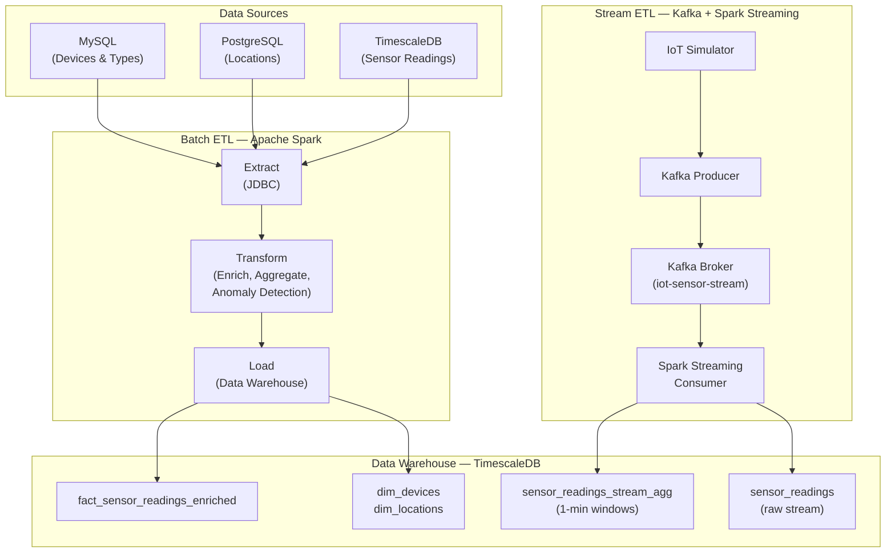

# ETL Learning Project: IoT Data Pipeline

A comprehensive hands-on project for learning **Batch ETL** (Apache Spark) and **Stream ETL** (Apache Kafka) using mockup IoT sensor data.

## 🏗️ Architecture



## Project Structure

```
etl-learning-project/
├── batch_etl/              # Batch ETL with Apache Spark
│   ├── spark_extract.py    # Extract from MySQL, PostgreSQL, TimescaleDB
│   ├── spark_transform.py  # Transform with enrichment & aggregations
│   ├── spark_load.py       # Load to data warehouse
│   └── run_batch_pipeline.py  # Pipeline orchestrator
│
├── stream_etl/             # Stream ETL with Kafka + Spark
│   ├── iot_simulator.py    # Realistic IoT data generator
│   ├── kafka_producer.py   # Publish to Kafka topic
│   ├── kafka_consumer.py   # Monitor Kafka messages
│   └── spark_streaming_consumer.py  # Spark Structured Streaming
│
├── warehouse/              # Data warehouse & analytics
│   ├── create_dwh_schema.sql  # Dimensional model schema
│   ├── analytical_queries.sql # Sample analytical queries
│   └── ml_feature_engineering.py  # ML-ready dataset preparation
│
├── docs/                   # Documentation
│   ├── ETL_CONCEPTS.md     # ETL best practices
│   ├── SPARK_GUIDE.md      # Apache Spark guide
│   └── KAFKA_GUIDE.md      # Apache Kafka guide
│
├── tests/                  # Unit and integration tests
├── monitoring/             # Pipeline monitoring
├── config.py               # Configuration management
├── requirements.txt        # Python dependencies
├── docker-compose.yml      # Docker services
└── .env.example            # Environment variables template

```

## Quick Start

### 1. Prerequisites

- Docker with running containers:
  - MySQL (port 3306)
  - PostgreSQL (port 5432)
  - TimescaleDB (port 5433)
  - Apache Spark (ports 8080, 7077)
  - Apache Kafka + Zookeeper (port 9092, 2181)
- Python 3.8+
- Existing IoT data in TimescaleDB (from `iot-system` project)

### 2. Setup

```powershell
# Navigate to project directory
cd C:\Users\tritr\Documents\Tritronik\etl-learning-project

# Create virtual environment
python -m venv .venv
.venv\Scripts\Activate.ps1

# Install dependencies
pip install -r requirements.txt

# Copy and configure environment variables
cp .env.example .env
# Edit .env with your database credentials

# Start Spark and Kafka services
docker-compose up -d

# Initialize data warehouse schema
# Run warehouse/create_dwh_schema.sql in DBeaver or psql
```

### 3. Run Batch ETL Pipeline

```powershell
# Run complete batch ETL pipeline
python batch_etl/run_batch_pipeline.py

# Run in test mode (limited data)
python batch_etl/run_batch_pipeline.py --test-mode

# Validate configuration only
python batch_etl/run_batch_pipeline.py --validate-only
```

**What it does:**
- Extracts device metadata from MySQL
- Extracts location data from PostgreSQL
- Extracts sensor readings from TimescaleDB (last 7 days)
- Enriches with rolling statistics and anomaly detection
- Loads to data warehouse with dimensional model

### 4. Run Stream ETL Pipeline

**Terminal 1: Start Kafka Producer**
```powershell
# Stream IoT data to Kafka (Ctrl+C to stop)
python stream_etl/kafka_producer.py

# Test mode (60 seconds)
python stream_etl/kafka_producer.py --test-mode

# Custom interval (every 2 seconds)
python stream_etl/kafka_producer.py --interval 2.0
```

**Terminal 2: Start Spark Streaming Consumer**
```powershell
# Consume from Kafka and write to TimescaleDB
python stream_etl/spark_streaming_consumer.py

# Debug mode (console output)
python stream_etl/spark_streaming_consumer.py --debug

# Test mode (console only, no database)
python stream_etl/spark_streaming_consumer.py --test-mode
```

**Terminal 3: Monitor Kafka Messages (Optional)**
```powershell
# Monitor messages in Kafka topic
python stream_etl/kafka_consumer.py

# Limit to 100 messages
python stream_etl/kafka_consumer.py --max-messages 100
```

## Verify Results

### Check Batch ETL Results

Open DBeaver and connect to TimescaleDB:

```sql
-- Check fact table
SELECT COUNT(*) FROM dwh.fact_sensor_readings_enriched;

-- View latest readings
SELECT * FROM dwh.v_latest_readings;

-- Check hourly aggregates
SELECT * FROM dwh.fact_hourly_agg
ORDER BY bucket DESC
LIMIT 24;

-- Anomaly trends
SELECT * FROM dwh.v_anomaly_trends_7d
WHERE device_id = 'TEMP-001';
```

### Check Stream ETL Results

```sql
-- Check streaming data arrival
SELECT COUNT(*), MAX(time) 
FROM sensor_readings 
WHERE time > NOW() - INTERVAL '1 minute';

-- Check windowed aggregates
SELECT * FROM sensor_readings_stream_agg
ORDER BY window_start DESC
LIMIT 10;
```

### Monitor Spark Jobs

- **Spark Master UI**: http://localhost:8080
- **Spark Worker UI**: http://localhost:8081

---

**Author**: [Your Name]  
**Last Updated**: 2026-02-13  
**Version**: 1.0
