# ETL Learning Project: IoT Data Pipeline

A comprehensive hands-on project for learning **Batch ETL** (Apache Spark) and **Stream ETL** (Apache Kafka) using real IoT sensor data.

## 🎯 Learning Objectives

- ✅ Understanding ETL concepts and best practices
- ✅ Mastering Batch ETL with Apache Spark
- ✅ Mastering Stream ETL with Apache Kafka
- ✅ Building ML-ready datasets for modeling

## 🏗️ Architecture

```mermaid
flowchart TD
    subgraph SOURCES["📦 Data Sources"]
        MySQL["🗄️ MySQL\n(Devices & Types)"]
        PG["🗄️ PostgreSQL\n(Locations)"]
        TS_SRC["🗄️ TimescaleDB\n(Sensor Readings)"]
    end

    subgraph BATCH["⚡ Batch ETL — Apache Spark"]
        direction LR
        B_EXT["Extract\n(JDBC)"] --> B_TRF["Transform\n(Enrich, Aggregate,\nAnomaly Detection)"] --> B_LOAD["Load\n(Data Warehouse)"]
    end

    subgraph STREAM["🌊 Stream ETL — Kafka + Spark Streaming"]
        direction LR
        SIM["🤖 IoT Simulator"] --> PROD["📤 Kafka Producer"] --> KAFKA["📨 Kafka Broker\n(iot-sensor-stream)"] --> CONS["📥 Spark Streaming\nConsumer"]
    end

    subgraph DWH["🏛️ Data Warehouse — TimescaleDB"]
        FACT["fact_sensor_readings_enriched"]
        DIM["dim_devices\ndim_locations"]
        AGG["sensor_readings_stream_agg\n(1-min windows)"]
        RAW["sensor_readings\n(raw stream)"]
    end

    MySQL --> B_EXT
    PG --> B_EXT
    TS_SRC --> B_EXT

    B_LOAD --> FACT
    B_LOAD --> DIM

    CONS --> RAW
    CONS --> AGG
```



## 📁 Project Structure

```
etl-learning-project/
├── batch_etl/              # Batch ETL with Apache Spark
│   ├── spark_extract.py    # Extract from MySQL, PostgreSQL, TimescaleDB
│   ├── spark_transform.py  # Transform with enrichment & aggregations
│   ├── spark_load.py       # Load to data warehouse
│   └── run_batch_pipeline.py  # Pipeline orchestrator
│
├── stream_etl/             # Stream ETL with Kafka + Spark
│   ├── iot_simulator.py    # Realistic IoT data generator
│   ├── kafka_producer.py   # Publish to Kafka topic
│   ├── kafka_consumer.py   # Monitor Kafka messages
│   └── spark_streaming_consumer.py  # Spark Structured Streaming
│
├── warehouse/              # Data warehouse & analytics
│   ├── create_dwh_schema.sql  # Dimensional model schema
│   ├── analytical_queries.sql # Sample analytical queries
│   └── ml_feature_engineering.py  # ML-ready dataset preparation
│
├── docs/                   # Documentation
│   ├── ETL_CONCEPTS.md     # ETL best practices
│   ├── SPARK_GUIDE.md      # Apache Spark guide
│   └── KAFKA_GUIDE.md      # Apache Kafka guide
│
├── tests/                  # Unit and integration tests
├── monitoring/             # Pipeline monitoring
├── config.py               # Configuration management
├── requirements.txt        # Python dependencies
├── docker-compose.yml      # Docker services
└── .env.example            # Environment variables template

```

## 🚀 Quick Start

### 1. Prerequisites

- Docker with running containers:
  - MySQL (port 3306)
  - PostgreSQL (port 5432)
  - TimescaleDB (port 5433)
  - Apache Spark (ports 8080, 7077)
  - Apache Kafka + Zookeeper (port 9092, 2181)
- Python 3.8+
- Existing IoT data in TimescaleDB (from `iot-system` project)

### 2. Setup

```powershell
# Navigate to project directory
cd C:\Users\tritr\Documents\Tritronik\etl-learning-project

# Create virtual environment
python -m venv .venv
.venv\Scripts\Activate.ps1

# Install dependencies
pip install -r requirements.txt

# Copy and configure environment variables
cp .env.example .env
# Edit .env with your database credentials

# Start Spark and Kafka services
docker-compose up -d

# Initialize data warehouse schema
# Run warehouse/create_dwh_schema.sql in DBeaver or psql
```

### 3. Run Batch ETL Pipeline

```powershell
# Run complete batch ETL pipeline
python batch_etl/run_batch_pipeline.py

# Run in test mode (limited data)
python batch_etl/run_batch_pipeline.py --test-mode

# Validate configuration only
python batch_etl/run_batch_pipeline.py --validate-only
```

**What it does:**
- Extracts device metadata from MySQL
- Extracts location data from PostgreSQL
- Extracts sensor readings from TimescaleDB (last 7 days)
- Enriches with rolling statistics and anomaly detection
- Loads to data warehouse with dimensional model

### 4. Run Stream ETL Pipeline

**Terminal 1: Start Kafka Producer**
```powershell
# Stream IoT data to Kafka (Ctrl+C to stop)
python stream_etl/kafka_producer.py

# Test mode (60 seconds)
python stream_etl/kafka_producer.py --test-mode

# Custom interval (every 2 seconds)
python stream_etl/kafka_producer.py --interval 2.0
```

**Terminal 2: Start Spark Streaming Consumer**
```powershell
# Consume from Kafka and write to TimescaleDB
python stream_etl/spark_streaming_consumer.py

# Debug mode (console output)
python stream_etl/spark_streaming_consumer.py --debug

# Test mode (console only, no database)
python stream_etl/spark_streaming_consumer.py --test-mode
```

**Terminal 3: Monitor Kafka Messages (Optional)**
```powershell
# Monitor messages in Kafka topic
python stream_etl/kafka_consumer.py

# Limit to 100 messages
python stream_etl/kafka_consumer.py --max-messages 100
```

## 📊 Verify Results

### Check Batch ETL Results

Open DBeaver and connect to TimescaleDB:

```sql
-- Check fact table
SELECT COUNT(*) FROM dwh.fact_sensor_readings_enriched;

-- View latest readings
SELECT * FROM dwh.v_latest_readings;

-- Check hourly aggregates
SELECT * FROM dwh.fact_hourly_agg
ORDER BY bucket DESC
LIMIT 24;

-- Anomaly trends
SELECT * FROM dwh.v_anomaly_trends_7d
WHERE device_id = 'TEMP-001';
```

### Check Stream ETL Results

```sql
-- Check streaming data arrival
SELECT COUNT(*), MAX(time) 
FROM sensor_readings 
WHERE time > NOW() - INTERVAL '1 minute';

-- Check windowed aggregates
SELECT * FROM sensor_readings_stream_agg
ORDER BY window_start DESC
LIMIT 10;
```

### Monitor Spark Jobs

- **Spark Master UI**: http://localhost:8080
- **Spark Worker UI**: http://localhost:8081

## 🎓 Learning Path

### Week 1: Batch ETL Fundamentals
1. Read `docs/ETL_CONCEPTS.md` - Understand ETL vs ELT
2. Read `docs/SPARK_GUIDE.md` - Learn Spark architecture
3. Run batch pipeline in test mode
4. Explore `batch_etl/spark_transform.py` - Study transformations
5. Modify transformation logic (add new features)

### Week 2: Stream ETL Fundamentals
1. Read `docs/KAFKA_GUIDE.md` - Learn Kafka concepts
2. Run IoT simulator standalone: `python stream_etl/iot_simulator.py`
3. Run Kafka producer and consumer separately
4. Study `spark_streaming_consumer.py` - Understand windowing
5. Modify window sizes and aggregations

### Week 3: Data Warehouse & Analytics
1. Study `warehouse/create_dwh_schema.sql` - Dimensional modeling
2. Run analytical queries from `warehouse/analytical_queries.sql`
3. Create custom analytical views
4. Explore continuous aggregates and compression

### Week 4: ML Feature Engineering
1. Run `warehouse/ml_feature_engineering.py`
2. Analyze exported ML datasets
3. Build simple anomaly detection model
4. Integrate model predictions back into pipeline

## 🔧 Configuration

### Database Connections

Edit `.env` file:

```env
# MySQL
MYSQL_HOST=localhost
MYSQL_PORT=3306
MYSQL_USER=root
MYSQL_PASSWORD=your_password
MYSQL_DATABASE=iot_devices

# PostgreSQL
POSTGRES_HOST=localhost
POSTGRES_PORT=5432
POSTGRES_USER=postgres
POSTGRES_PASSWORD=your_password
POSTGRES_DATABASE=iot_locations

# TimescaleDB
TIMESCALE_HOST=localhost
TIMESCALE_PORT=5433
TIMESCALE_USER=postgres
TIMESCALE_PASSWORD=your_password
TIMESCALE_DATABASE=iot_timeseries
```

### Spark Configuration

Modify `config.py`:

```python
class SparkConfig:
    SPARK_MASTER_URL = 'spark://localhost:7077'
    EXECUTOR_MEMORY = '2g'
    EXECUTOR_CORES = 2
    DRIVER_MEMORY = '1g'
```

### Kafka Configuration

```python
class KafkaConfig:
    BOOTSTRAP_SERVERS = 'localhost:9092'
    TOPIC_IOT_STREAM = 'iot-sensor-stream'
```

## 📚 Key Concepts Demonstrated

### Batch ETL
- **Extract**: JDBC connectors for parallel data extraction
- **Transform**: Data enrichment, rolling statistics, anomaly detection
- **Load**: Incremental loading with upsert logic
- **Data Quality**: Validation, null handling, quality scores

### Stream ETL
- **Kafka Producer**: Message batching, compression, partitioning
- **Spark Structured Streaming**: Micro-batch processing, windowing
- **Exactly-Once Semantics**: Checkpointing, idempotent writes
- **Real-Time Aggregations**: Tumbling windows, stateful operations

### Data Warehouse
- **Dimensional Modeling**: Fact and dimension tables
- **Time-Series Optimization**: Hypertables, compression, retention
- **Continuous Aggregates**: Pre-computed aggregations
- **Analytical Views**: Simplified query interfaces

## 🐛 Troubleshooting

### Spark Connection Issues

```powershell
# Check Spark cluster status
docker ps | grep spark

# View Spark master logs
docker logs spark-master-etl

# Restart Spark services
docker-compose restart spark-master spark-worker
```

### Kafka Connection Issues

```powershell
# Check Kafka status
docker ps | grep kafka

# List Kafka topics
docker exec -it kafka-etl kafka-topics --bootstrap-server localhost:9093 --list

# View Kafka logs
docker logs kafka-etl
```

### Database Connection Issues

```powershell
# Test database connections
python -c "from config import DatabaseConfig; print(DatabaseConfig.get_timescale_connection_string())"

# Check if databases are running
docker ps | grep -E "mysql|postgres|timescale"
```

## 📈 Next Steps

1. **Add Orchestration**: Integrate Apache Airflow for scheduled batch jobs
2. **Build Dashboard**: Create Streamlit dashboard for real-time visualization
3. **ML Integration**: Train and deploy anomaly detection models
4. **Data Lineage**: Implement data lineage tracking
5. **Performance Tuning**: Optimize Spark partitions and Kafka configurations

## 📖 Documentation

- [ETL Concepts & Best Practices](docs/ETL_CONCEPTS.md)
- [Apache Spark Guide](docs/SPARK_GUIDE.md)
- [Apache Kafka Guide](docs/KAFKA_GUIDE.md)
- [Implementation Plan](../brain/implementation_plan.md)

## 🤝 Contributing

This is a learning project. Feel free to:
- Add more transformation logic
- Create additional analytical queries
- Implement new features
- Improve documentation

## 📝 License

Educational project for learning purposes.

---

**Author**: [Your Name]  
**Last Updated**: 2026-02-13  
**Version**: 1.0
